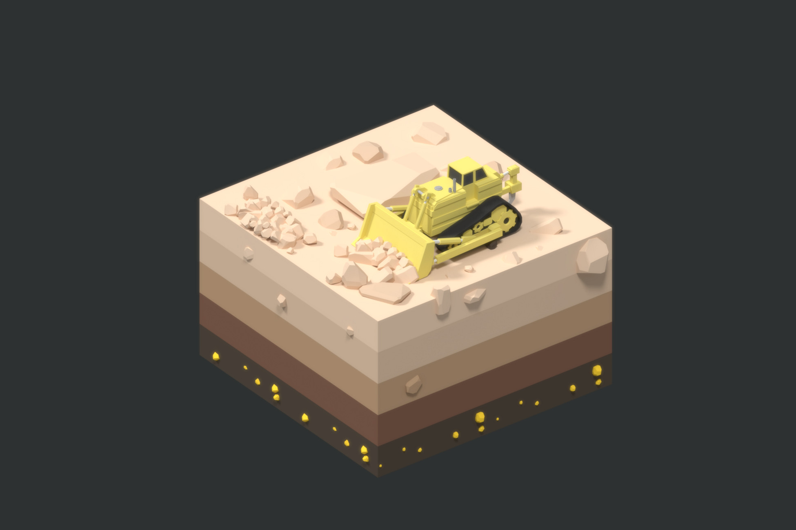
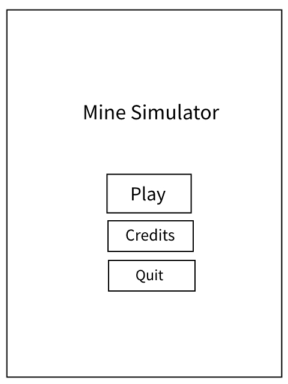
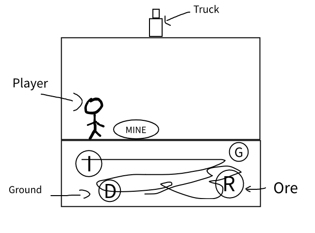

# MINE SIMULATOR

By: Yohib Hussain

---

<h1 align="left">Main Menu</h1>

This is the main menu of the game with the Play , Credits and Quit

---

<h6 align="left">Game Mechanics & Control</h6>

There will be a joystick to control the player the player can basically mine and collect mines like iron, gold, diamond,ruby and etc. Which are at different costs.

 

The player then can collect the minerals and place it in the truck which will generate the money basing on the mineral collected

---
<h1 align="left">Game Loop</h1>

This is the very simple game loop

---

# Aestheticism in the game

<ul align="left" class="small-text">
    <li>Kids will spend a little time on their own</li>
    <li>They will get some knowledge about the names of the ores</li>
    <li>They will get determined to comeplete the game</li>
    <li>The game is meant solely for children because of it's repeated nature but even Adults can also enjoy playing the game with their little ones.</li>
</ul>

---

Everything in this document is made with<a href="https://marp.app/"> Marp</a>, it is really good software for making presentation with code.

#### Yes this is made with code

# THANK YOU!
